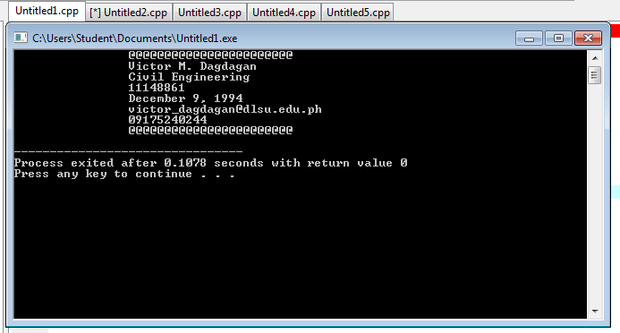
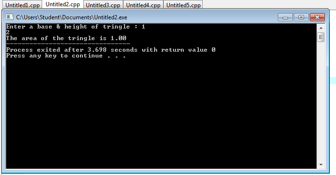
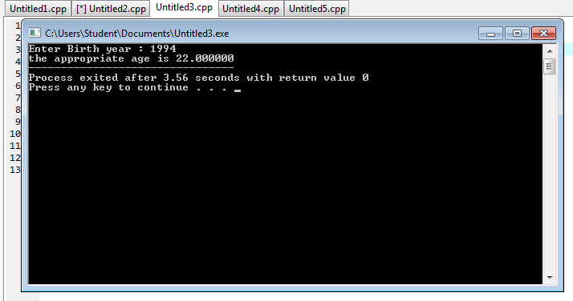

# Activity1-DagdaganV
```
#include <stdio.h>
#include <stdlib.h>

int main()
{
printf("\t\t@@@@@@@@@@@@@@@@@@@@@@@\n");
printf("\t\tVictor M. Dagdagan\n");
printf("\t\tCivil Engineering\n");
printf("\t\t111*****\n");
printf("\t\tDecember 9, 1994\n");
printf("\t\tvictor_dagdagan@dlsu.edu.ph\n");
printf("\t\t09175240244\n");
printf("\t\t@@@@@@@@@@@@@@@@@@@@@@@\n");

}
```

```
#include<stdio.h>
#include<stdlib.h>
int main()
{
   float b, h, area;
   printf("Enter a base & height of tringle : ");
   scanf("%f %f", &b, &h);
   area = (b*h)/2;
   printf("The area of the tringle is %.2f", area);
}
```

```
#include<stdio.h>
#include<stdlib.h>
int main()
{
   int yr;
   float n;
   printf("Enter Birth year : ");
   scanf("%d", &yr);
   
   n = 2016 - yr;
   printf ("the appropriate age is %f",n);
}
```

```
#include<stdio.h>
#include<stdlib.h>
int main()
{
   int X;
   float C;
   printf("Enter the Value of X : ");
   scanf("%d", &X);
   
   C = X/70;
   printf ("the value of X is %f",C);
}
   ```
   .png)
   ```
   
